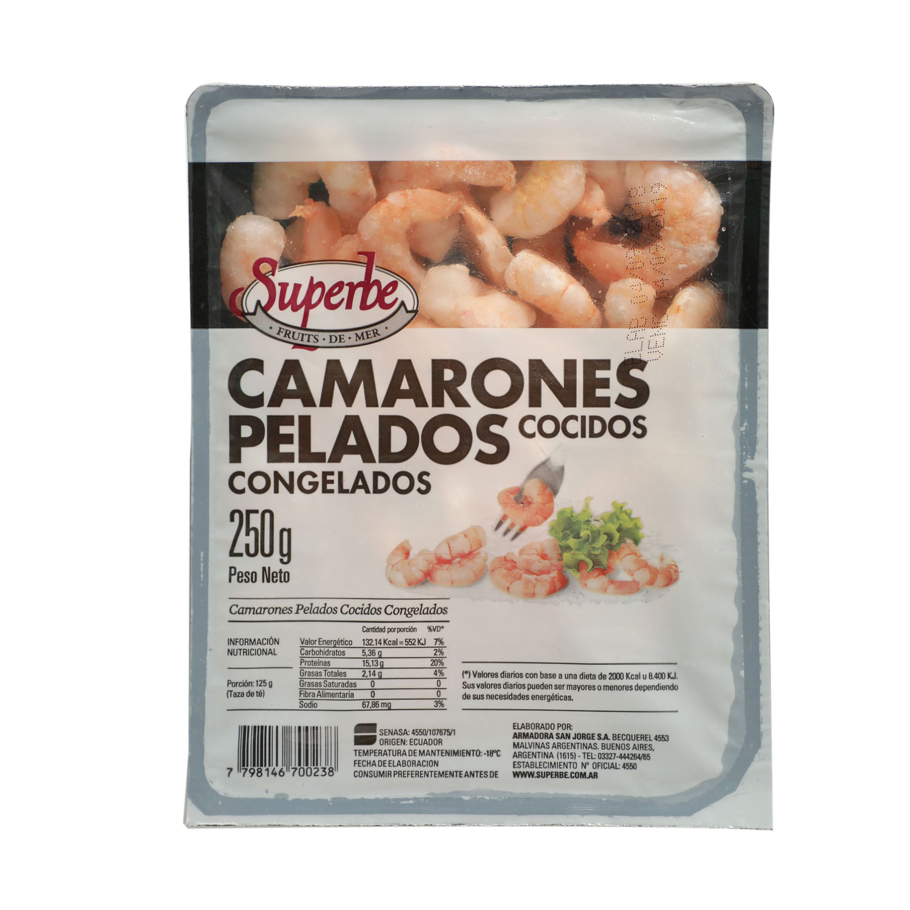

# Camarones pelados cocidos congelados

| Característica | Dato |
|---|---|
| Categoría | Congelados / pescados y mariscos |
| Marca | Superbe |
| Producto | Camarones pelados cocidos congelados |
| Presentación | 250 g |
| Estado | Congelado |
| Tratamiento del producto | Pelados y cocidos |
| Código de barras | 7798146700238 |
| Temperatura de mantenimiento | -18 °C |
| Origen declarado | Ecuador |
| Elaborado por | Armadora San Jorge S.A. |
| Registro | SENASA 4550/107675/1 |

## Información nutricional declarada

Valores por porción de 125 g:

| Nutriente | Valor |
|---|---:|
| Valor energético | 132,14 kcal / 552 kJ |
| Carbohidratos | 5,36 g |
| Proteínas | 15,13 g |
| Grasas totales | 2,14 g |
| Grasas saturadas | 0 g |
| Fibra alimentaria | 0 g |
| Sodio | 67,86 mg |

Fuente: [Carrefour](https://www.carrefour.com.ar/camarones-pelados-cocidos-congelados-250-g/p)
