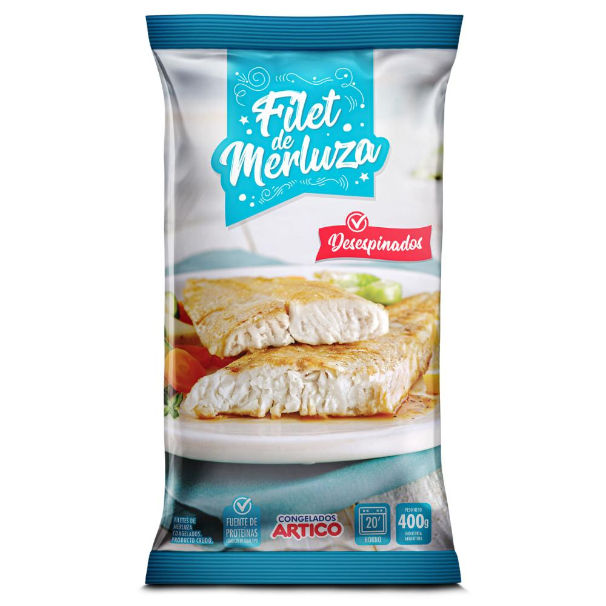

# Filet de merluza congelado

| Característica | Dato |
|---|---|
| Categoría | Congelado / pescado |
| Marca | Congelados Ártico |
| Producto | Filet de merluza |
| Presentación | 400 g |
| Formato | Filet |
| Estado | Congelado |
| Nombre científico | *Merluccius hubbsi* |
| Origen | Argentina |
| Código de producto | 3111-70-AR-0400 |
| Caja master | 8 kg |
| Características sensoriales | Sabor suave; carne no muy firme |
| Fuente | Congelados Ártico |

## Conservación declarada

| Condición | Vigencia |
|---|---|
| Freezer a -18 °C | 1 año |
| Congelador a -4 °C | 7 días |
| Heladera a 4 °C | 24 horas |

## Información nutricional declarada

| Dato | Valor |
|---|---:|
| Valor energético | 89 kcal por 100 g |
| Grasas | Menos de 3 % |
| Proteínas | Alto contenido |
| Otros componentes declarados | Omega-3, selenio, fósforo y potasio |

Fuente: [Congelados Ártico — Filet de merluza 400 g](https://congeladosartico.com/productos/linea-productos-del-mar/linea-natural/filet-de-merluza-400-g/)
