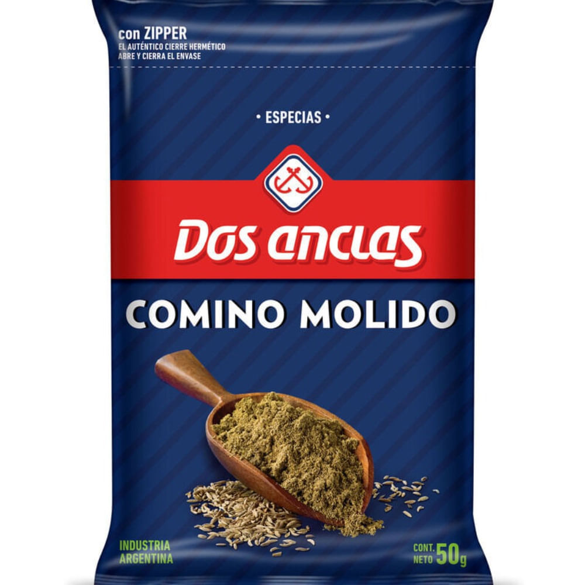

# Comino molido Dos Anclas 50 g

| Característica | Dato |
|---|---|
| Categoría | Especia y condimento |
| Producto | Comino molido |
| Marca | Dos Anclas |
| Formato | Polvo |
| Estado | Seco |
| Presentación | 50 g |
| Código de barras | 7792900009339 |
| Código de producto | 150322 |
| Vendedor/fuente | Carrefour |

Fuente: [Carrefour — Comino molido Dos Anclas 50 g](https://www.carrefour.com.ar/comino-molido-dos-anclas-50-g-20665/p)
