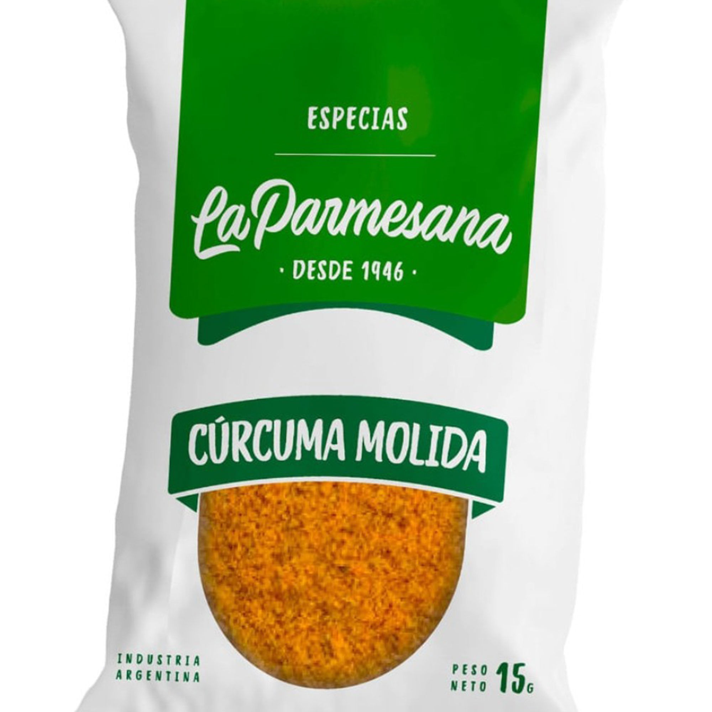

# Cúrcuma molida La Parmesana 15 g

| Característica | Dato |
|---|---|
| Categoría | Especia y condimento |
| Producto | Cúrcuma molida |
| Marca | La Parmesana |
| Formato | Polvo |
| Estado | Seco |
| Presentación | Sobre de 15 g |
| Código de barras | 7798224213278 |
| Código de producto | 767688 |
| Vendedor/fuente | Carrefour |

Fuente: [Carrefour — Cúrcuma molida La Parmesana 15 g](https://www.carrefour.com.ar/curcuma-molida-la-parmesana-en-sobre-15-grs-767688/p)
