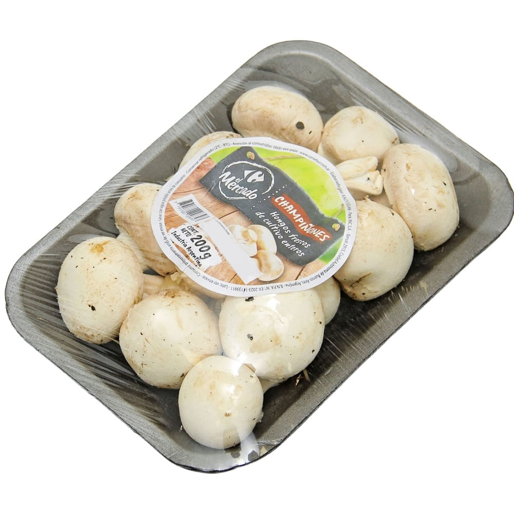

# Champiñones blancos El Mercado 200 g

| Característica | Dato |
|---|---|
| Categoría | Fresco / hongo |
| Producto | Champiñón blanco |
| Marca | El Mercado |
| Formato | Entero |
| Estado | Fresco |
| Presentación | Bandeja de 200 g |
| Código de barras | 7791720028797 |
| Código de producto | 735984 |
| Vendedor/fuente | Carrefour |

Fuente: [Carrefour — Champiñón blanco El Mercado 200 g](https://www.carrefour.com.ar/champinon-blanco-el-mercado-200-g-735984/p)
