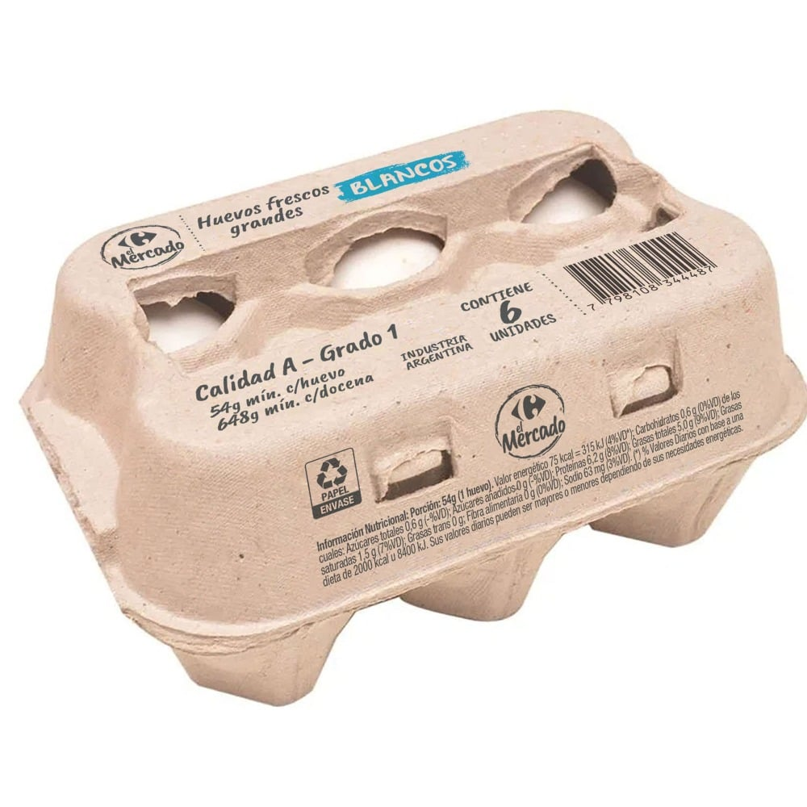

# Huevos blancos El Mercado — 6 unidades

| Característica | Dato |
|---|---|
| Categoría | Fresco / huevo |
| Marca | El Mercado |
| Tipo | Huevos frescos blancos con cáscara |
| Calidad | A — Grado 1 |
| Presentación | Envase de 6 unidades |
| Peso mínimo por huevo | 54 g |
| Origen declarado | Industria Argentina |
| Envase | Papel |
| Código de barras | 7798108344487 |
| Código de producto | 380313 |

Fuente: [Carrefour — Huevos blancos El Mercado 6 unidades](https://www.carrefour.com.ar/huevos-blancos-el-mercado-6-uni-380313/p)
