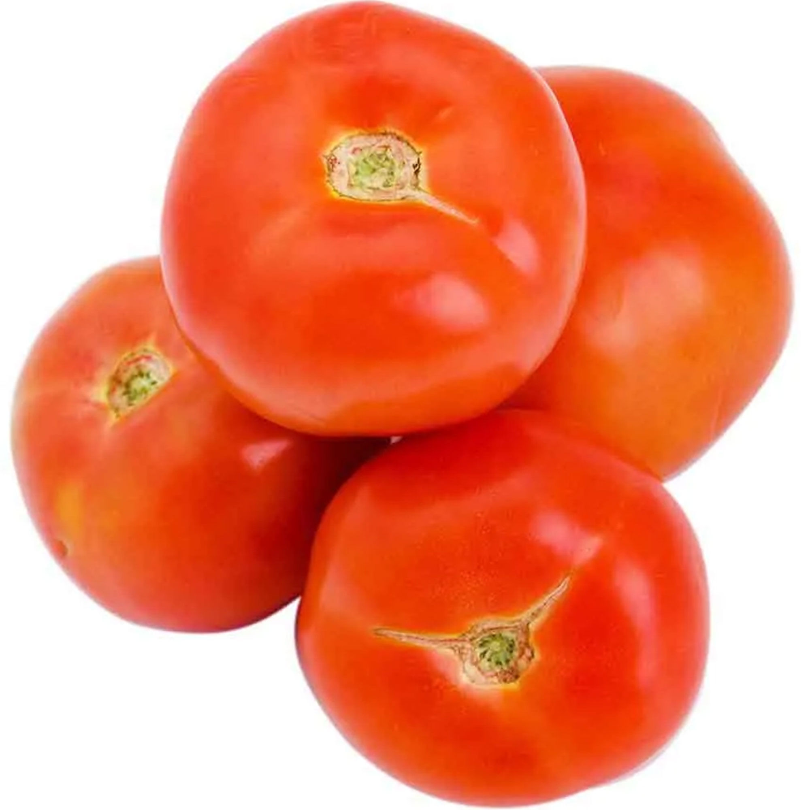

# Tomate redondo Huella Natural

| Característica | Dato |
|---|---|
| Categoría | Fresco / hortaliza |
| Tipo de producto | Tomate redondo |
| Marca | Huella Natural |
| Presentación comercial | Venta por kilogramo |
| Unidad de medida | kg |
| País de origen | Argentina |
| Código EAN | 2508816000002 |
| Código de producto | 718963 |

Fuente: [Carrefour — Tomate redondo Huella Natural x kg](https://www.carrefour.com.ar/tomate-redondo-huella-natural-x-kg-718963/p)
