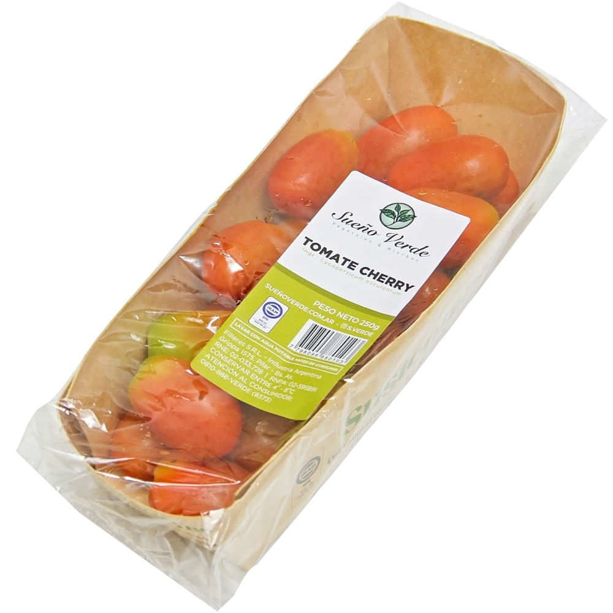

# Tomates cherry Sueño Verde 250 g

| Característica | Dato |
|---|---|
| Categoría | Fresco / fruta |
| Producto | Tomate cherry |
| Marca | Sueño Verde |
| Formato | Entero |
| Estado | Fresco |
| Presentación | Envase de 250 g |
| Código de barras | 7798096880103 |
| Código de producto | 708385 |
| Variedad botánica declarada | *Solanum lycopersicum* |
| Vendedor/fuente | Carrefour |

Fuente: [Carrefour — Tomates cherry Sueño Verde 250 g](https://www.carrefour.com.ar/tomates-cherry-sueno-verde-250-g-708385/p)
