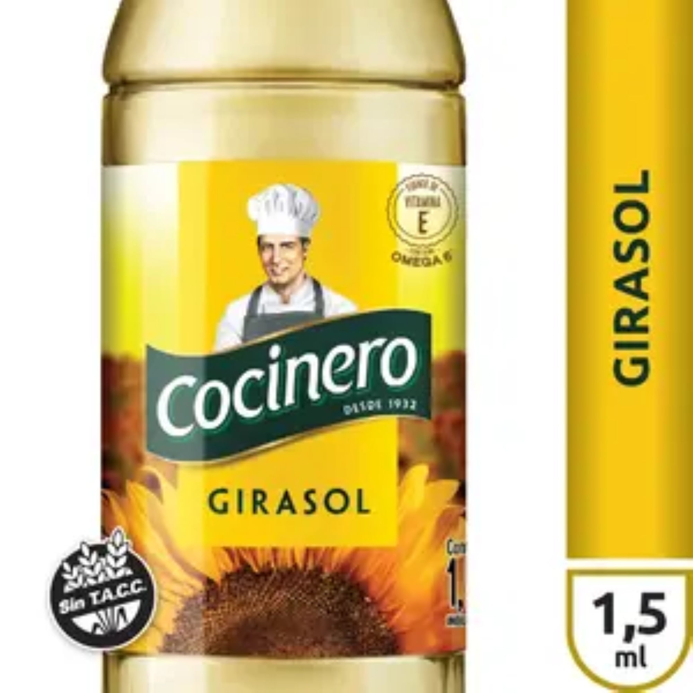

# Aceite de girasol Cocinero 1,5 l

| Característica | Dato |
|---|---|
| Categoría | Seco y envasado |
| Tipo de producto | Aceite de girasol |
| Marca | Cocinero |
| Presentación | Botella |
| Contenido neto | 1,5 l |
| Rótulo | Sin TACC |
| Código EAN | 7790060023684 |
| SKU | 41078 |
| Código de producto | 6307 |

Fuente: [Carrefour — Aceite de girasol Cocinero 1,5 l](https://www.carrefour.com.ar/aceite-de-girasol-cocinero-15-l-41078/p)
