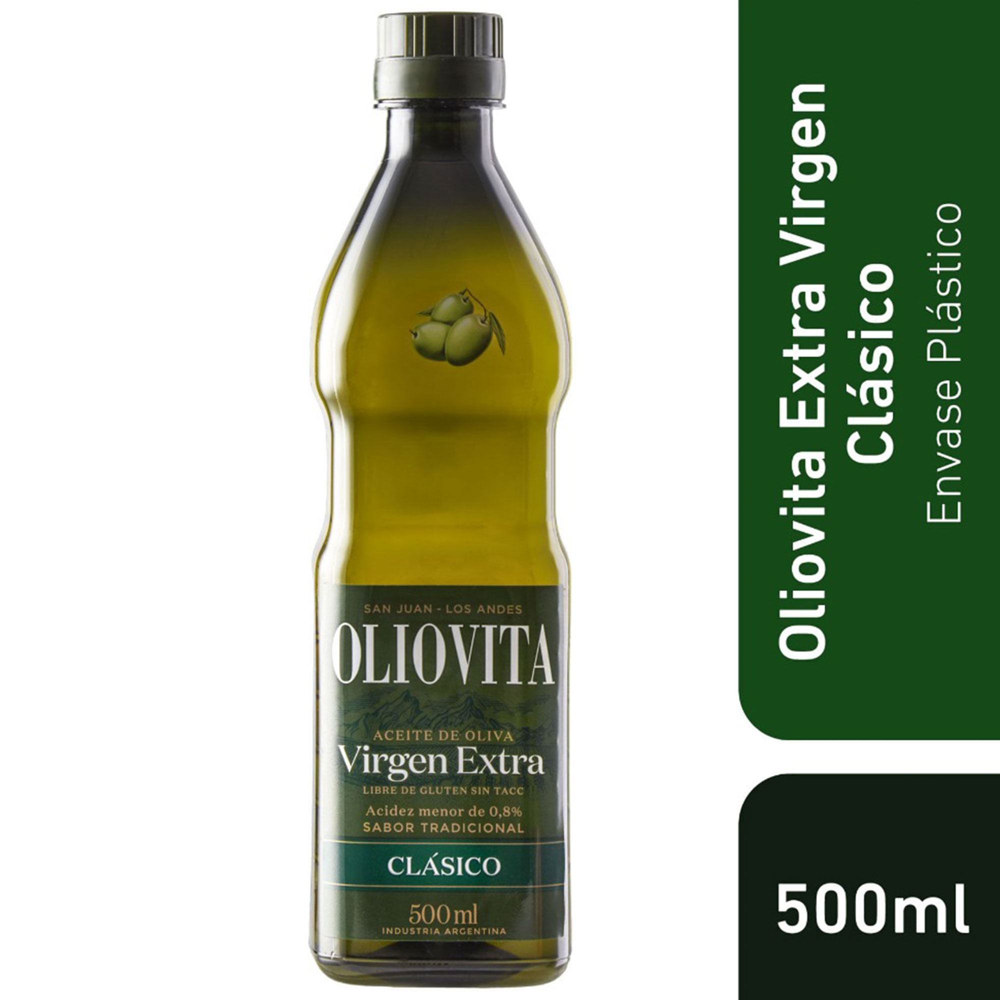

# Aceite de oliva Oliovita extra virgen 500 cc

| Característica | Dato |
|---|---|
| Categoría | Aceite / envasado |
| Producto | Aceite de oliva extra virgen |
| Marca | Oliovita |
| Línea | Clásico |
| Presentación | Botella de 500 ml |
| Estado | Líquido |
| Acidez declarada | Menor a 0,8 % |
| Característica declarada | Libre de gluten / Sin TACC |
| Origen declarado | Industria Argentina |
| Código de barras | 7798061190312 |
| Código de producto | 436123 |
| Vendedor/fuente | Carrefour |

Fuente: [Carrefour — Aceite de oliva Oliovita extra virgen 500 cc](https://www.carrefour.com.ar/aceite-de-oliva-oliovita-extra-virgen-500-cc/p)
