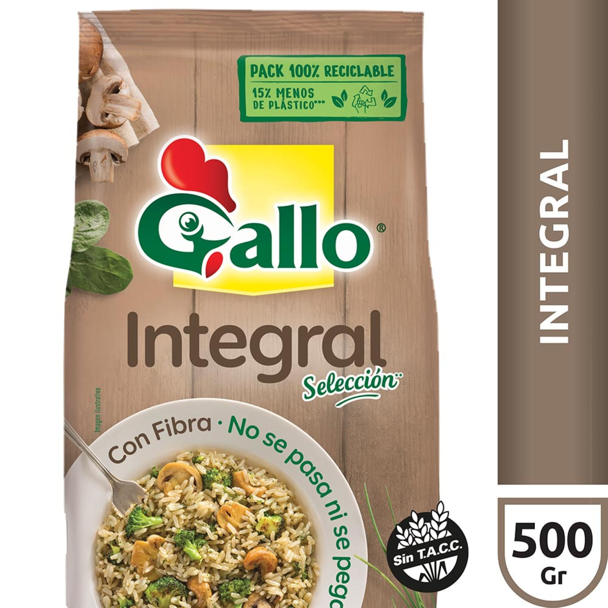

# Arroz integral Gallo 500 g

| Característica | Dato |
|---|---|
| Categoría | Seco y envasado |
| Producto | Arroz integral |
| Marca | Gallo |
| Línea | Selección |
| Formato | Grano integral |
| Estado | Seco |
| Presentación | Bolsa de 500 g |
| Característica declarada | Con fibra |
| Certificación declarada | Sin TACC |
| Envase | 100 % reciclable; 15 % menos de plástico, según imagen |
| Código de barras | 7790070433152 |
| Código de producto | 733190 |
| Vendedor/fuente | Carrefour |

Fuente: [Carrefour — Arroz integral Gallo en bolsa 500 g](https://www.carrefour.com.ar/arroz-integral-gallo-en-bolsa-500-g-733190/p)
