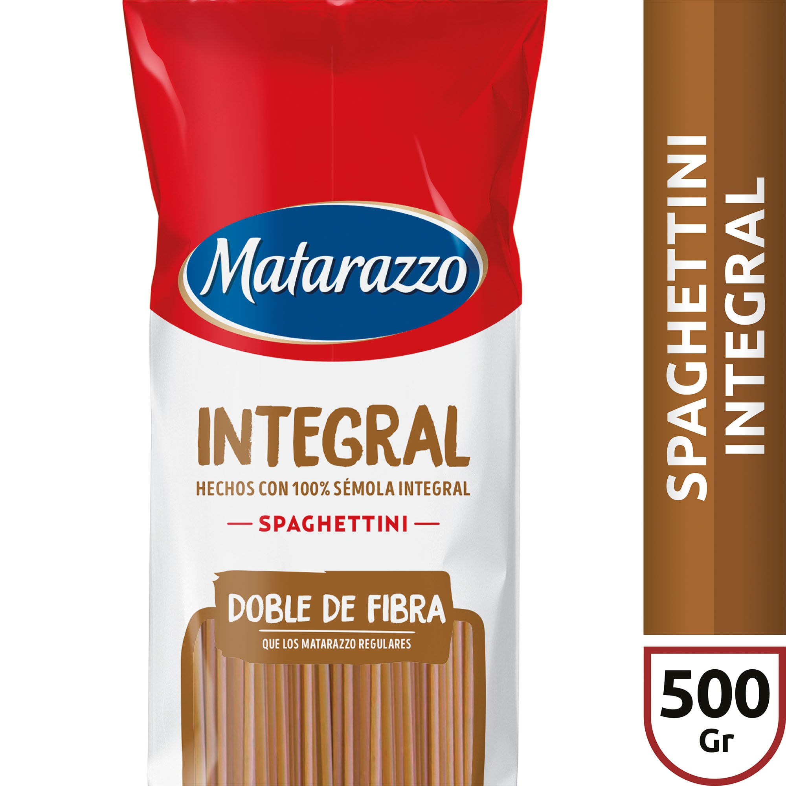

# Fideos integrales spaghetti Matarazzo 500 g

| Característica | Dato |
|---|---|
| Categoría | Seco y envasado |
| Producto | Spaghettini integral |
| Marca | Matarazzo |
| Formato | Pasta seca larga |
| Estado | Seco |
| Presentación | Paquete de 500 g |
| Composición destacada | 100 % sémola integral |
| Característica declarada | Doble de fibra que los Matarazzo regulares |
| Código de barras | 7790070335975 |
| Código de producto | 726308 |
| Vendedor/fuente | Carrefour |

Fuente: [Carrefour — Fideos integrales spaghetti Matarazzo 500 g](https://www.carrefour.com.ar/fideos-integrales-spaghetti-matarazzo-500-g-726308/p)
