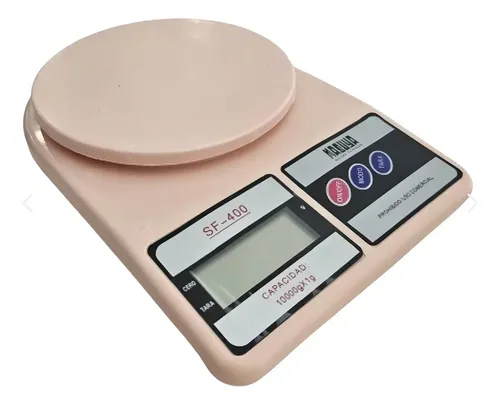

# Balanza digital de cocina Masuya SF-400

| Especificación | Dato |
|---|---|
| Tipo | Balanza digital de cocina |
| Marca | Masuya |
| Modelo | SF-400 |
| Capacidad máxima | 10 kg |
| Sensibilidad / división | 1 g |
| Función | Tara / puesta a cero |
| Apagado automático | Sí |
| Alimentación | Pilas |
| Recipiente incluido | No |
| Pilas incluidas | No |

Fuente: [MercadoLibre — Balanza digital de cocina Masuya SF-400](https://www.mercadolibre.com.ar/balanza-digital-cocina-10kg-precision-1g-masuya-sf400/up/MLAU4818736329?pdp_filters=item_id:MLA2013030401)
