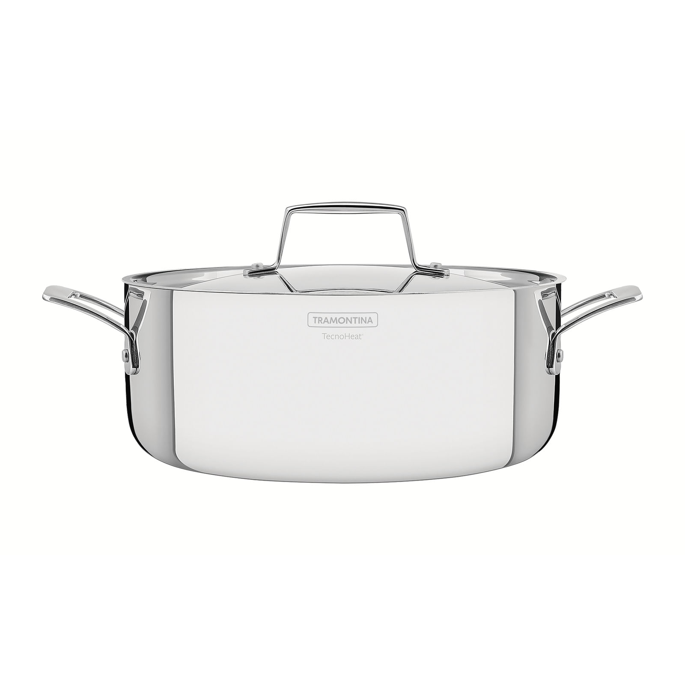

# Cacerola plana Tramontina Allegra 24 cm

| Especificación | Dato |
|---|---|
| Marca/línea | Tramontina Allegra |
| Tipo | Cacerola rasa/plana |
| Diámetro | 24 cm |
| Capacidad | 4,2 L |
| Material | Acero inoxidable |
| Fondo | Triple: acero inoxidable + aluminio + acero inoxidable |
| Tapa | Vidrio con salida de vapor |
| Cocinas compatibles | Gas, eléctrica, vitrocerámica e inducción |
| Uso en horno | Hasta 260 °C |
| Lavavajillas | Sí |
| Dimensiones | 31,7 × 26,3 × 15,5 cm |
| Peso aproximado | 1,6 kg |

## Incluye

- Cacerola rasa de 24 cm.
- Tapa de vidrio con salida de vapor.
