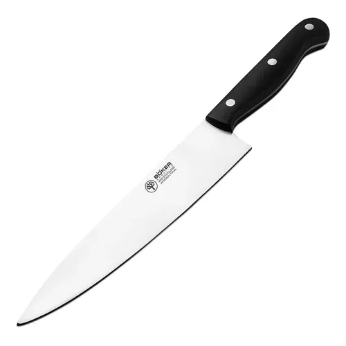

# Cuchillo Böker Arbolito Chef II 8308

| Especificación | Dato |
|---|---|
| Marca | Böker Arbolito |
| Línea/modelo | Chef II, Gourmet 8308 |
| Tipo | Cuchillo de chef |
| Largo de hoja | 20 cm |
| Largo total | 33,5 cm |
| Espesor | 2,5 mm; algunas fichas indican 3,5 mm |
| Peso aproximado | 180–181 g |
| Material de hoja | Acero inoxidable 498 o 440 Inox Plus, según ficha |
| Mango | Resina acetal POM, negro |
| Lavavajillas | No especificado de forma uniforme |

## Incluye

- 1 cuchillo Böker Arbolito Chef II 8308.
