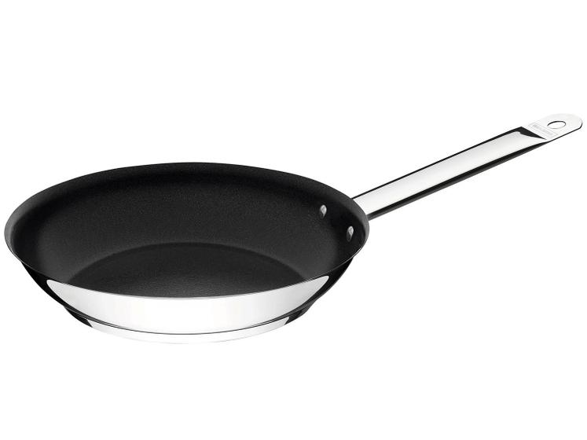

# Sartén Tramontina Professional 26 cm

| Especificación | Dato |
|---|---|
| Marca/línea | Tramontina Professional |
| Referencia | 62635260 |
| Tipo | Sartén rasa |
| Diámetro | 26 cm |
| Capacidad | 2 L en Mercado Libre; 2,2 L en ficha equivalente |
| Material | Acero inoxidable |
| Fondo | Triple: acero inoxidable + aluminio + acero inoxidable |
| Revestimiento | Sin antiadherente |
| Mango | Tubular fijo de acero inoxidable |
| Cocinas compatibles | Gas, eléctrica, vitrocerámica e inducción |
| Uso en horno | Hasta 260 °C |
| Lavavajillas | Sí |
| Tapa | No incluida |
| Espesor | 0,8 mm |

## Incluye

- 1 sartén Professional de 26 cm.
- Mango tubular fijo de acero inoxidable.
