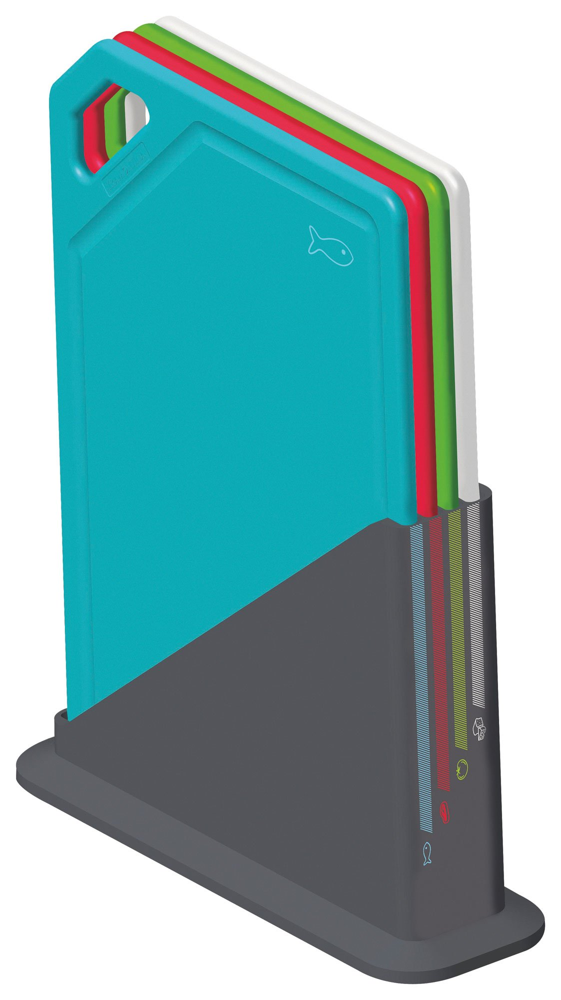

# Juego de tablas de corte Tramontina Mix Color

| Especificación | Dato |
|---|---|
| Marca/modelo | Tramontina Mix Color, 25099/940 |
| Cantidad | 4 tablas |
| Material de tablas | Polipropileno |
| Material del soporte | ABS |
| Medida nominal | Aproximadamente 28,5 × 19,7 cm por tabla |
| Medida del aviso | 28 × 19 cm |
| Espesor | 5–7 mm, según ficha |
| Forma | Rectangular |
| Protección antimicrobiana | Sí |
| BPA | Libre de BPA, según ficha comercial |
| Lavavajillas | Sí |
| Soporte | Sí |
| Peso del conjunto | Aproximadamente 1,4–1,55 kg |

## Identificación por color

| Color | Categoría asignada |
|---|---|
| Rojo | Carnes crudas |
| Celeste | Pescados y mariscos crudos |
| Verde | Verduras, frutas y vegetales |
| Blanco | Panes, quesos y alimentos listos |

## Incluye

- 4 tablas de corte.
- 1 soporte de ABS.
