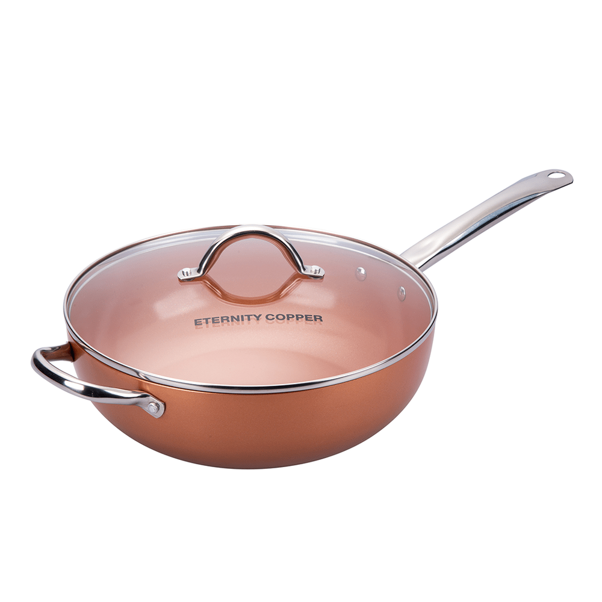

# Wok Eternity Copper 30 cm

| Especificación | Dato |
|---|---|
| Marca/modelo | Eternity Copper Wok Extra Grande |
| Tipo | Wok redondo antiadherente |
| Capacidad | Hasta 5 L |
| Diámetro | 30 cm |
| Altura | 10 cm |
| Material del cuerpo | Aluminio con cerámica y cobre |
| Superficie | Antiadherente Ceramic-Tech |
| Base | Disco inductivo de acero inoxidable |
| Distribución del calor | 360° |
| Cocinas compatibles | Gas, eléctrica, cerámica e inducción |
| Uso | Hornalla y horno |
| Peso aproximado | 1,57 kg |
| Asas | Dobles, ergonómicas |
| Tapa | Vidrio templado con válvula de vapor |
| Lavavajillas | Publicado como apto |

## Incluye

- Wok de 30 cm.
- Bandeja vaporiera.
- Canasta freidora/coladora.
- Tapa de vidrio templado.
- Recetario.
- Instructivo.
