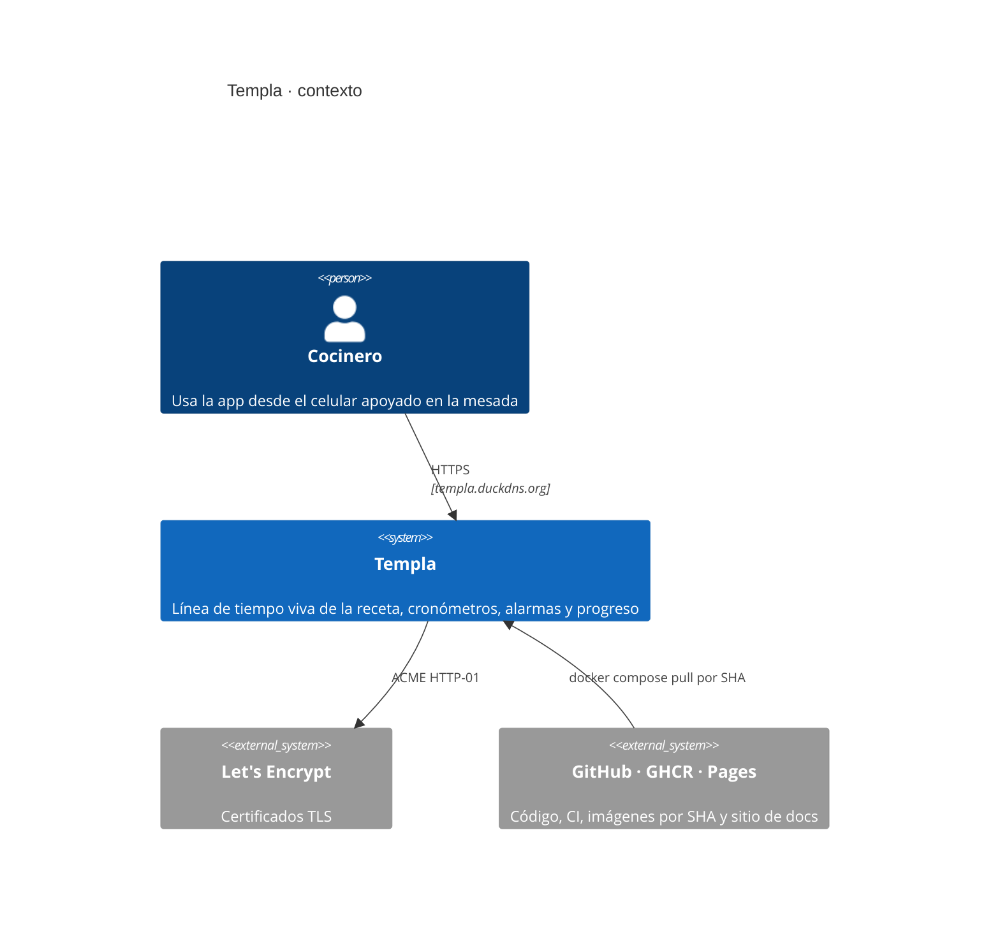
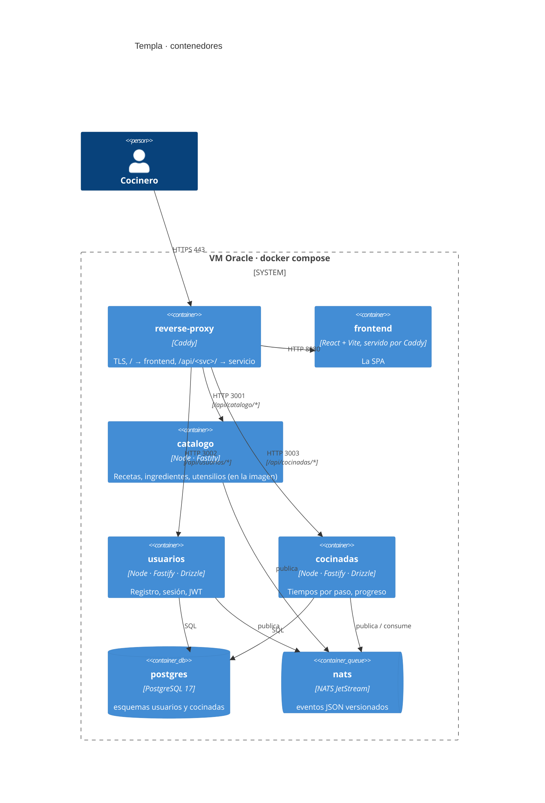
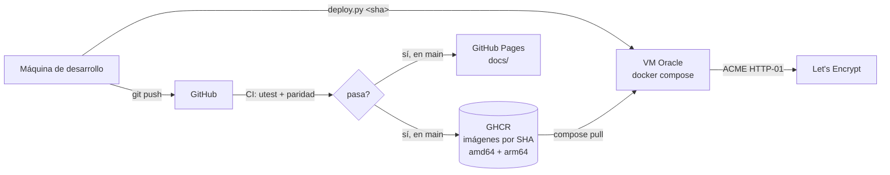

# Arquitectura

**Qué hace el sistema:** guía la preparación de un plato como una línea de tiempo con
cronómetros por paso y alarmas para los procesos que corren solos, y guarda los tiempos
de cada cocinada por usuario para mostrar el progreso por receta.

Los diagramas de esta página están en [diagrams/](diagrams/) como Mermaid.

## Vista de contexto



## Componentes

| Componente | Carpeta | Responsabilidad | Estado / tecnología |
|---|---|---|---|
| **frontend** | `microservices/frontend` | La SPA completa para cocinar, con el diseño del prototipo de Figma Make de Carlos (naranja de marca, Nunito y Space Mono, y los dos temas del prototipo: claro sobre marfil y oscuro, que se cambian en Ajustes y se guardan en el teléfono): pantalla de bienvenida con la mesada armada en capas y las dos formas de entrar (con Google, que espera al servicio `usuarios`, o sin cuenta), inicio con saludo y barra de experiencia, tarjetas grandes de recetas, portada con foto a sangre, valores, modos de preparación con ícono e ingredientes y utensilios, mise en place con checklist y porcentaje, pantalla de cocina (cronómetro por paso con exceso y reinicio, procesos que corren solos, gantt vertical que se pinta a medida que avanza la cocinada, alarma sonora y vibración, pausa entre etapas con los pasos hechos), resumen final que festeja con confeti y sonido, muestra los puntos ganados y los logros desbloqueados y guarda la cocinada, progreso por receta con gráfico, y perfil con nivel, experiencia, números de la cocina, logros e interruptor de tema. Los logros (`src/logros.ts`) se calculan a partir de las cocinadas guardadas, no se almacenan. La experiencia (`src/xp.ts`) se recalcula a partir de las cocinadas guardadas y premia la precisión contra los tiempos de la receta, no la velocidad; el criterio exacto de puntos es provisional. Barra inferior con Recetas, Progreso y Perfil. Las cocinadas se guardan en el teléfono (localStorage) hasta que existan usuarios y cocinadas. | React 19 + TypeScript, compilada con Vite y servida por Caddy como archivos estáticos (ADR-013). Sin estado propio ni enrutador: la navegación es un objeto de estado en `App`. |
| **catalogo** | `microservices/catalogo` | Recetas, ingredientes y utensilios. Solo lectura: `GET /recetas`, `GET /recetas/:plato/:version` y las fotos (ver README). | Fastify (ADR-007). Al arrancar carga en memoria los JSON de `data/recetas/` e indexa la foto de cada ficha; todo va dentro de la imagen (ADR-006). Sin base de datos. |
| **usuarios** | `microservices/usuarios` | Registro, inicio de sesión, perfil. Emite los JWT. | Fastify + Drizzle sobre PostgreSQL (ADR-005, ADR-008). Autorización por JWT firmado con `JWT_SECRET` (ADR-012). |
| **cocinadas** | `microservices/cocinadas` | Tiempos reales por paso de cada cocinada de un usuario; progreso por receta. | Fastify + Drizzle sobre PostgreSQL. Verifica los JWT localmente. |
| **reverse-proxy** | `infrastructure/reverse-proxy` | Único punto de entrada: TLS, la SPA en `/`, cada servicio bajo `/api/<servicio>/`. | Caddy (ADR-009). |
| **postgres** | — | Persistencia de usuarios y cocinadas. | PostgreSQL 17, una instancia, un esquema por servicio (ADR-005). |
| **nats** | — | Broker de eventos entre servicios. | NATS JetStream (ADR-003), mensajes JSON con esquema en `contratos/eventos/` (ADR-004). |



## Cómo se comunican

- **El navegador habla solo con el reverse proxy**, por HTTPS. Caddy quita el prefijo
  `/api/<servicio>` antes de reenviar, así que ningún servicio sabe bajo qué ruta está
  publicado y la misma imagen sirve para cualquier despliegue.
- **Entre servicios, eventos por NATS JetStream** (ADR-003). Un servicio no llama por HTTP
  a otro: publica un hecho («cocinada registrada») y quien lo necesita lo consume. Los
  mensajes son JSON con sobre común y esquema versionado en `contratos/eventos/`
  (ADR-004); cada servicio copia los esquemas que usa y una prueba de integración
  verifica que las copias sigan idénticas.
- **Lo que un servicio necesita saber de otro en el momento de atender una petición,
  lo tiene en su propia base** porque lo recibió antes por evento. Cuando eso no alcance
  (la primera vez que aparezca una consulta síncrona entre servicios), es un ADR nuevo, y
  la regla de la invariante 3 aplica: distinguir «no hay» de «no pude preguntar».
- **La autorización es un JWT** (ADR-012) que emite `usuarios` y que `cocinadas` verifica
  localmente con la misma clave. No hay llamada a `usuarios` por petición.

```mermaid
sequenceDiagram
  title Registrar una cocinada (diseño previsto; el esqueleto todavía no lo implementa)
  actor C as Cocinero
  participant F as frontend
  participant P as reverse-proxy
  participant K as cocinadas
  participant DB as postgres
  participant N as nats
  C->>F: termina el plato · «Guardar esta vez»
  F->>P: POST /api/cocinadas/cocinadas (JWT)
  P->>K: POST /cocinadas
  K->>K: verifica el JWT con JWT_SECRET
  K->>DB: INSERT cocinada + tiempos por paso
  K->>N: publica templa.cocinadas.cocinada-registrada.v1
  K-->>P: 201 {id, total_s, desvio_s}
  P-->>F: 201
  F-->>C: resumen y progreso de la receta
```

## Configuración y despliegue

Un solo `docker-compose.yml` para todos los ambientes; lo que cambia entre ambientes vive
en el `.env` y en ningún otro lado (ADR-001). Una variable ausente corta el arranque. Las
imágenes se construyen en el CI para `amd64` y `arm64`, se publican en GHCR etiquetadas
por SHA, y `deployment/oracle-single/deploy.py` trae exactamente ese SHA a la VM
(ADR-011). Detalle en [DEPLOYMENT.md](DEPLOYMENT.md).



## Decisiones y sus ADR

| Decisión | ADR |
|---|---|
| Un solo compose, el `.env` como fuente de la verdad, sin fallbacks | [ADR-001](adr/ADR-001-compose-unico-y-env-como-fuente-de-verdad.md) |
| Tres microservicios: catalogo, usuarios, cocinadas | [ADR-002](adr/ADR-002-tres-microservicios.md) |
| Eventos con NATS JetStream | [ADR-003](adr/ADR-003-eventos-con-nats-jetstream.md) |
| Mensajes JSON con esquema versionado en el repo | [ADR-004](adr/ADR-004-mensajes-json-con-esquema-versionado.md) |
| PostgreSQL para usuarios y cocinadas | [ADR-005](adr/ADR-005-postgresql-para-usuarios-y-cocinadas.md) |
| El catálogo se lee de los JSON del repo y va dentro de la imagen | [ADR-006](adr/ADR-006-catalogo-desde-el-repositorio-en-la-imagen.md) |
| Fastify como framework HTTP | [ADR-007](adr/ADR-007-fastify.md) |
| Drizzle como acceso a la base | [ADR-008](adr/ADR-008-drizzle-orm.md) |
| Caddy como reverse proxy y TLS | [ADR-009](adr/ADR-009-caddy-reverse-proxy-y-tls.md) |
| pnpm, Vitest y Stryker | [ADR-010](adr/ADR-010-pnpm-vitest-y-stryker.md) |
| Despliegue en una VM de Oracle con imágenes multi-arquitectura en GHCR | [ADR-011](adr/ADR-011-despliegue-en-vm-oracle-con-imagenes-por-sha.md) |
| Autorización con JWT emitido por usuarios y verificado localmente | [ADR-012](adr/ADR-012-autorizacion-con-jwt.md) |
| El frontend como SPA React + Vite en su propia imagen | [ADR-013](adr/ADR-013-frontend-spa-react-vite.md) |

## Lo que el esqueleto no tiene todavía

Nada de lógica de negocio: ni endpoints de recetas, ni registro de usuarios, ni cocinadas.
Cada servicio arranca, valida su configuración, se conecta a lo que depende (base, broker)
y contesta `/health`. El catálogo ya sirve las recetas. La SPA tiene la pantalla de inicio (logo, lema «Tu receta, al punto justo» y «Empezar», sobre la foto de la mesada), la lista de recetas con la foto del plato, y la portada con la pestaña de versiones, los ingredientes con foto y las etapas; y la pantalla de cocina completa según el mockup: el modelo de la cocinada es puro (`src/cocina/modelo.ts`) y la pantalla solo lo dibuja con un tic de medio segundo. Los procesos arrancan cuando se da por hecho el paso que los dispara; un proceso crítico que vence tapa todo con la alarma (sonido repetido cada 2 s y vibración) y, si el paso actual era una espera, al atenderla sigue con el paso que corresponde; los no críticos avisan suave y desaparecen. Los huecos que la receta deja entre pasos se muestran como cuenta regresiva para empezar. Antes de cocinar, la mise en place obliga a tildar cada utensilio e ingrediente. Al terminar, «Guardar esta cocinada» la deja en el teléfono y la pestaña Progreso dibuja el tiempo de cada intento contra el objetivo. Lo que sigue: `usuarios` con registro y sesión, y `cocinadas` para sincronizar ese mismo registro con el perfil. Lo
que sigue, en orden previsto: endpoints de lectura de `catalogo` sobre los JSON de
`data/recetas/`, la pantalla de cocina del mockup contra ellos, `usuarios` con registro y
sesión, y `cocinadas` con el registro de tiempos y el gráfico de progreso.
