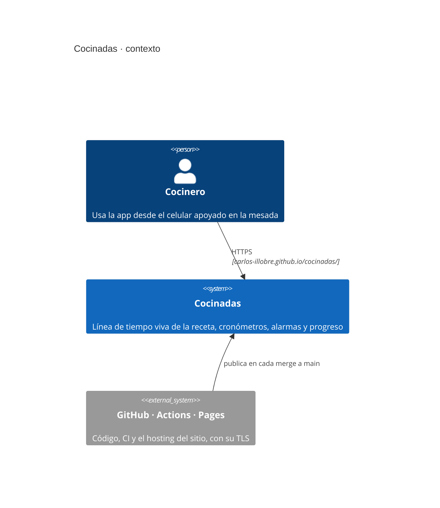
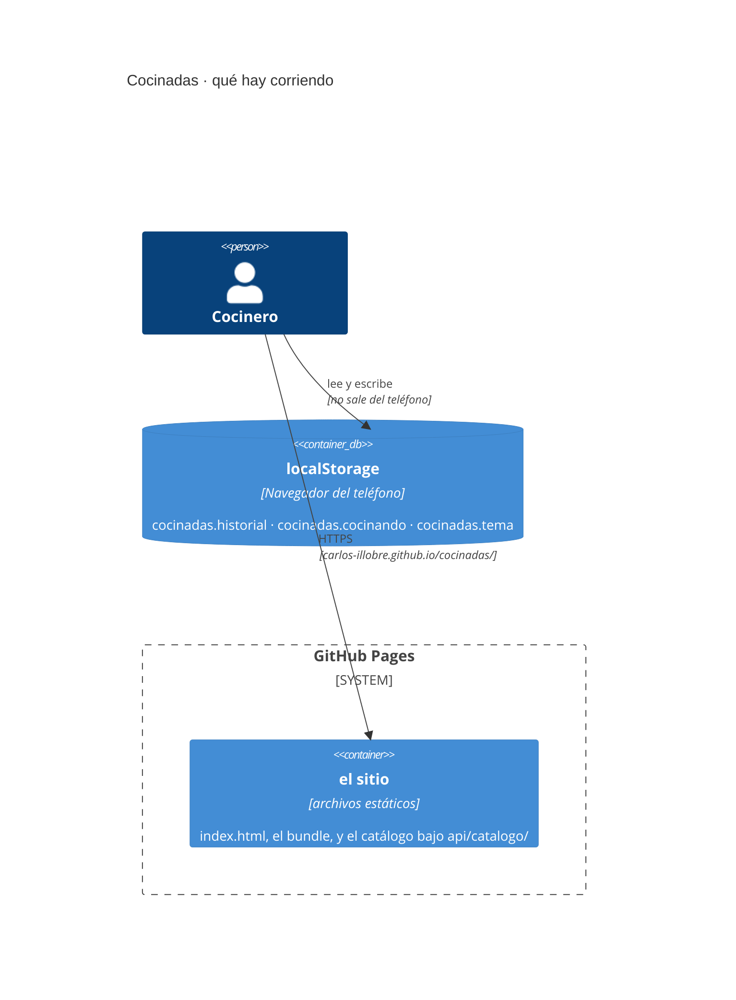
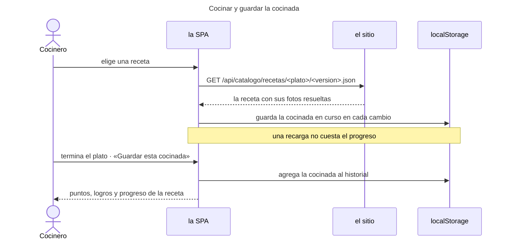
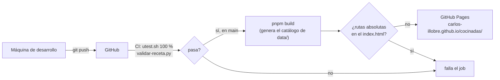

# Arquitectura

**Qué hace el sistema:** guía la preparación de un plato como una línea de tiempo con
cronómetros por paso y alarmas para los procesos que corren solos, y guarda los tiempos
de cada cocinada para mostrar el progreso por receta.

**Cómo está hecho:** una SPA que se baja entera al teléfono, con el catálogo de recetas
adentro, publicada como sitio estático en **GitHub Pages**. Las cocinadas viven en el
`localStorage` de cada teléfono.

El porqué está en [ADR-015](adr/ADR-015-de-cuatro-servicios-a-una-spa-estatica.md) y
[ADR-017](adr/ADR-017-sitio-estatico-en-github-pages.md), que también dicen qué haría falta
el día que eso no alcance.

**La app está en <https://carlos-illobre.github.io/cocinadas/>.**

Los diagramas de esta página están en [diagrams/](diagrams/) como Mermaid.

## Vista de contexto

## Componentes

Lo que se publica son archivos. Lo que sigue es cómo se arman.

| Componente | Carpeta | Responsabilidad | Tecnología |
|---|---|---|---|
| **la SPA** | `web/src` | Toda la aplicación (ver abajo). | React 19 + TypeScript, compilada con Vite (ADR-013). |
| **el catálogo** | `web/src/catalogo` | Lee `data/recetas/`, `data/ingredientes/` y `data/utencillos/` **en el build** y escribe el JSON y las fotos que la SPA consume. | Node, corre una vez por publicación con `tsx`. `catalogo.ts` es puro y decide qué archivos van; `generar.ts` solo los escribe (ADR-006, ADR-015). |
| **el hosting** | — | Sirve `web/dist/` por HTTPS, con CDN. | GitHub Pages (ADR-017). |

### Qué hace la SPA

Pantalla de bienvenida con la mesada armada en capas y las dos formas de entrar; inicio
con saludo y barra de experiencia; tarjetas grandes de recetas; portada con foto a sangre,
valores, modos de preparación con ícono e ingredientes y utensilios; mise en place con
checklist y porcentaje; pantalla de cocina (cronómetro por paso con exceso y reinicio,
procesos que corren solos, gantt vertical que se pinta a medida que avanza la cocinada,
alarma sonora y vibración, pausa entre etapas); resumen final que festeja con confeti y
sonido, muestra los puntos ganados y los logros desbloqueados y guarda la cocinada;
progreso por receta con gráfico; y perfil con nivel, experiencia, números de la cocina,
logros e interruptor de tema.

El diseño sale del prototipo de Figma Make de Carlos: naranja de marca, Nunito y Space
Mono, y los dos temas del prototipo (claro sobre marfil y oscuro), que se cambian en
Ajustes y se guardan en el teléfono.

No tiene estado propio ni enrutador: la navegación es una pila de pantallas en `App`,
atada al historial del navegador para que el botón de atrás del teléfono vuelva de
pantalla en vez de salir de la app. La cocinada en curso se guarda en el teléfono a cada
cambio, así una recarga no cuesta el progreso. Los logros (`src/logros.ts`) y la
experiencia (`src/xp.ts`) no se almacenan: se recalculan a partir de las cocinadas
guardadas. La experiencia premia la precisión contra los tiempos de la receta, no la
velocidad; el criterio exacto de puntos es provisional.

## Cómo se comunican

- **Todo lo que pide el navegador son archivos**: el `index.html`, los assets con hash, y
  el catálogo bajo `api/catalogo/`.
- **El catálogo son archivos, no una API.** `api/catalogo/recetas.json` es la lista y
  `api/catalogo/recetas/<plato>/<version>.json` es una receta entera, con las rutas de las
  fotos ya resueltas. `api.ts` es el único que sabe que llevan `.json`.
- El prefijo `api/` se conserva a propósito: es la puerta por la que vuelve un backend sin
  tocar el frontend (ADR-015).
- **Todas las rutas son relativas.** Pages sirve el sitio en `/<repo>/`, así que una ruta
  absoluta apuntaría al dominio. Con `base: './'` el mismo bundle sirve en cualquier lado
  (ADR-017).
- **Las cocinadas no salen del teléfono.** `historial/almacen.ts` las guarda en un
  `Almacen` inyectado, que hoy es `localStorage`. Que sea inyectado es lo que deja
  cambiarlo por un cliente HTTP el día que haya cuentas.

## Configuración y despliegue

Hay un solo ambiente: el sitio publicado. Cada merge a `main` corre las pruebas, compila y
publica en Pages. Detalle en [DEPLOYMENT.md](DEPLOYMENT.md).

El catálogo se genera en el build leyendo `data/` (ADR-006), así que el sitio publicado
siempre corresponde a un commit entero: revertir el código revierte también las recetas, y
agregar una receta obliga a volver a publicar.

## Decisiones y sus ADR

| Decisión | ADR |
|---|---|
| El catálogo se lee de los JSON del repo y viaja con lo que se publica | [ADR-006](adr/ADR-006-catalogo-desde-el-repositorio-en-la-imagen.md) |
| pnpm y Vitest, con compuerta del 100 % | [ADR-010](adr/ADR-010-pnpm-vitest-y-stryker.md) |
| La aplicación como SPA React + Vite | [ADR-013](adr/ADR-013-frontend-spa-react-vite.md) |
| **De cuatro servicios a una sola SPA estática** | [**ADR-015**](adr/ADR-015-de-cuatro-servicios-a-una-spa-estatica.md) |
| **Sitio estático en GitHub Pages, sin servidor propio** | [**ADR-017**](adr/ADR-017-sitio-estatico-en-github-pages.md) |

El resto está **superado o enmendado**, y eso es información: el proyecto empezó como
cuatro microservicios con PostgreSQL, NATS y JWT (ADR 002 a 012), pasó por un solo
contenedor con Caddy y un proxy propio (ADR 009, 011, 016) y terminó acá. Ninguno se borró:
son el punto de partida para volver a decidir el día que las cocinadas salgan del celular.
El índice completo está en [adr/README.md](adr/README.md).

## Lo que todavía no está

- **Cuentas de usuario.** La bienvenida ofrece entrar con Google, pero no hay a quién
  preguntarle: hoy se entra sin cuenta y las cocinadas quedan en ese teléfono. El camino
  para agregarlo está escrito en ADR-015.
- **El criterio de puntos es provisional.** `puntosDe` en `src/xp.ts` premia la precisión
  contra los tiempos de la receta; los números exactos están por acordar con Carlos.
- **Una sola receta en el catálogo**, con sus dos versiones.
