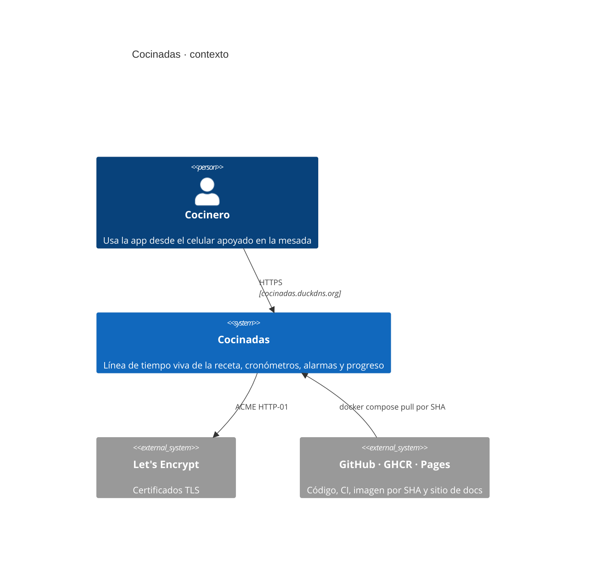
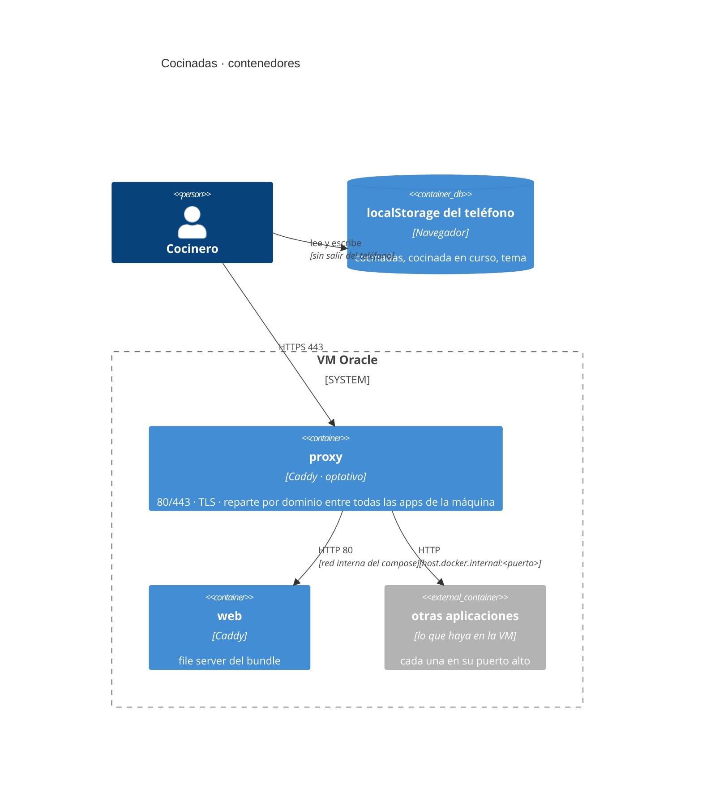
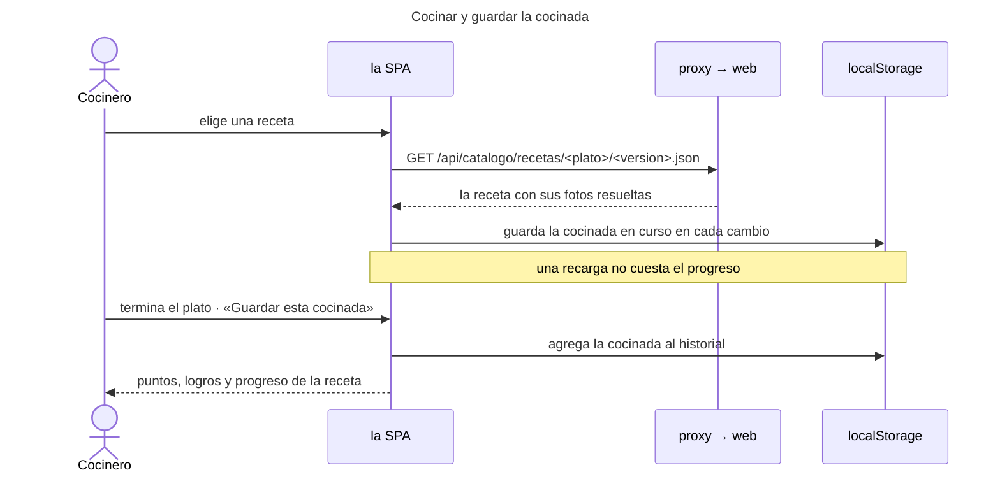
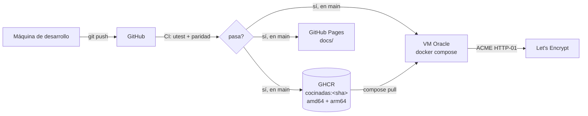

# Arquitectura

**Qué hace el sistema:** guía la preparación de un plato como una línea de tiempo con
cronómetros por paso y alarmas para los procesos que corren solos, y guarda los tiempos
de cada cocinada para mostrar el progreso por receta.

**Cómo está hecho:** una SPA que se baja entera al teléfono, con el catálogo de recetas
adentro, servida como archivos estáticos por Caddy. No hay backend: las cocinadas viven en
el `localStorage` de cada teléfono. El porqué, y el camino de vuelta el día que eso no
alcance, están en [ADR-015](adr/ADR-015-de-cuatro-servicios-a-una-spa-estatica.md).

**Delante hay un reverse proxy que no es de esta aplicación**: en la VM corre más de una
app y el 80 y el 443 son de una sola, así que los ata una pieza aparte que reparte por
dominio. Es optativa —se prende desde el `.env`— porque en otro ambiente ese trabajo lo
puede hacer un balanceador de la nube ([ADR-016](adr/ADR-016-proxy-de-la-maquina-como-pieza-aparte.md)).

Los diagramas de esta página están en [diagrams/](diagrams/) como Mermaid.

## Vista de contexto

## Componentes

La aplicación es una sola. El proxy no es parte de ella: es infraestructura de la máquina,
y por eso vive en `infrastructure/`, la carpeta de lo que sirve para levantar la aplicación
y que en producción puede estar reemplazado por un servicio de la nube.

| Componente | Carpeta | Responsabilidad | Estado / tecnología |
|---|---|---|---|
| **web** | `microservices/frontend` | La aplicación: sirve el bundle (la SPA más el catálogo). Habla HTTP en `:80` y contesta a cualquier `Host`: no termina TLS ni sabe por qué dominio la llamaron. | Caddy en modo file server (ADR-013). Sin Node en producción: la imagen final no lleva `node_modules`. |
| **proxy** *(optativo)* | `infrastructure/proxy` | El reverse proxy **de la máquina**: ata el 80 y el 443, emite y renueva el TLS, y reparte por dominio entre esta app y las demás de la VM. Se prende con `COMPOSE_PROFILES=proxy`. | Caddy, imagen oficial sin construir (ADR-009, ADR-016). |
| **la SPA** | `microservices/frontend/src` | Toda la aplicación (ver abajo). | React 19 + TypeScript, compilada con Vite. |
| **el catálogo** | `microservices/frontend/src/catalogo` | Lee `data/recetas/`, `data/ingredientes/` y `data/utencillos/` **en el build** y escribe el JSON y las fotos que la SPA consume. | Node, corre una vez por despliegue con `tsx`. `catalogo.ts` es puro y decide qué archivos van; `generar.ts` solo los escribe (ADR-006, ADR-015). |

### Qué hace la SPA

Pantalla de bienvenida con la mesada armada en capas y las dos formas de entrar; inicio
con saludo y barra de experiencia; tarjetas grandes de recetas; portada con foto a sangre,
valores, modos de preparación con ícono e ingredientes y utensilios; mise en place con
checklist y porcentaje; pantalla de cocina (cronómetro por paso con exceso y reinicio,
procesos que corren solos, gantt vertical que se pinta a medida que avanza la cocinada,
alarma sonora y vibración, pausa entre etapas); resumen final que festeja con confeti y
sonido, muestra los puntos ganados y los logros desbloqueados y guarda la cocinada;
progreso por receta con gráfico; y perfil con nivel, experiencia, números de la cocina,
logros e interruptor de tema.

El diseño sale del prototipo de Figma Make de Carlos: naranja de marca, Nunito y Space
Mono, y los dos temas del prototipo (claro sobre marfil y oscuro), que se cambian en
Ajustes y se guardan en el teléfono.

No tiene estado propio ni enrutador: la navegación es una pila de pantallas en `App`,
atada al historial del navegador para que el botón de atrás del teléfono vuelva de
pantalla en vez de salir de la app. La cocinada en curso se guarda en el teléfono a cada
cambio, así una recarga no cuesta el progreso. Los logros (`src/logros.ts`) y la
experiencia (`src/xp.ts`) no se almacenan: se recalculan a partir de las cocinadas
guardadas. La experiencia premia la precisión contra los tiempos de la receta, no la
velocidad; el criterio exacto de puntos es provisional.

## Cómo se comunican

- **El navegador habla con el proxy**, por HTTPS. El proxy mira el dominio, decide de qué
  aplicación es y le pasa la petición. Para Cocinadas todo lo que sigue son archivos: el
  `index.html`, los assets con hash, y el catálogo bajo `/api/catalogo/`.
- **La aplicación no sabe nada del proxy.** Escucha en `:80` y contesta a cualquier `Host`,
  así que la misma imagen sirve igual en `localhost`, detrás del proxy propio o detrás del
  de otra aplicación. Lo que sí se queda en su imagen son las cabeceras de seguridad, la
  política de contenido, el ruteo de la SPA y el caché: es de la aplicación y se despliega
  con el código que lo necesita.
- **El catálogo son archivos, no una API.** `GET /api/catalogo/recetas.json` es la lista y
  `GET /api/catalogo/recetas/<plato>/<version>.json` es una receta entera, con las rutas
  de las fotos ya resueltas. `api.ts` es el único que sabe que llevan `.json`.
- Se conserva el prefijo `/api/` a propósito, aunque no haya ninguna API detrás: es la
  puerta por la que vuelve un backend sin tocar el frontend (ADR-015).
- **Las cocinadas no salen del teléfono.** `historial/almacen.ts` las guarda en un
  `Almacen` inyectado, que hoy es `localStorage`. Que sea inyectado es lo que deja
  cambiarlo por un cliente HTTP el día que haya cuentas.

## Configuración y despliegue

Un solo `docker-compose.yml` para todos los ambientes; lo que cambia entre ambientes vive
en el `.env` y en ningún otro lado (ADR-001). Una variable ausente corta el arranque. La
imagen se construye en el CI para `amd64` y `arm64`, se publica en GHCR etiquetada por
SHA, y `deployment/oracle-single/deploy.py` trae exactamente ese SHA a la VM (ADR-011).
Cada merge a `main` dispara ese despliegue solo. Detalle en [DEPLOYMENT.md](DEPLOYMENT.md).

El catálogo viaja dentro de la imagen (ADR-006), así que revertir un despliegue revierte
también las recetas, y agregar una receta obliga a reconstruir y redesplegar.

## Decisiones y sus ADR

| Decisión | ADR |
|---|---|
| Un solo compose, el `.env` como fuente de la verdad, sin fallbacks | [ADR-001](adr/ADR-001-compose-unico-y-env-como-fuente-de-verdad.md) |
| El catálogo se lee de los JSON del repo y va dentro de la imagen | [ADR-006](adr/ADR-006-catalogo-desde-el-repositorio-en-la-imagen.md) |
| Caddy como servidor y TLS automático | [ADR-009](adr/ADR-009-caddy-reverse-proxy-y-tls.md) |
| El reverse proxy es de la máquina, no de la aplicación | [ADR-016](adr/ADR-016-proxy-de-la-maquina-como-pieza-aparte.md) |
| pnpm, Vitest y Stryker | [ADR-010](adr/ADR-010-pnpm-vitest-y-stryker.md) |
| Despliegue en una VM de Oracle con imagen multi-arquitectura en GHCR | [ADR-011](adr/ADR-011-despliegue-en-vm-oracle-con-imagenes-por-sha.md) |
| La aplicación como SPA React + Vite | [ADR-013](adr/ADR-013-frontend-spa-react-vite.md) |
| Endurecimiento antes de publicar a internet | [ADR-014](adr/ADR-014-endurecimiento-antes-de-publicar.md) |
| **De cuatro servicios a una sola SPA estática** | [**ADR-015**](adr/ADR-015-de-cuatro-servicios-a-una-spa-estatica.md) |

Los ADR 002, 003, 004, 005, 007, 008 y 012 están **superados por el 015**: describen los
microservicios, NATS, PostgreSQL, Fastify, Drizzle y los JWT que el proyecto tuvo
declarados y nunca llegó a usar. No se borran: el día que el historial salga del celular,
son el punto de partida para volver a decidir.

## Lo que todavía no está

- **Cuentas de usuario.** La bienvenida ofrece entrar con Google, pero no hay a quién
  preguntarle: hoy se entra sin cuenta y las cocinadas quedan en ese teléfono. El camino
  para agregarlo está escrito en ADR-015.
- **El criterio de puntos es provisional.** `puntosDe` en `src/xp.ts` premia la precisión
  contra los tiempos de la receta; los números exactos están por acordar con Carlos.
- **Una sola receta en el catálogo**, con sus dos versiones.
