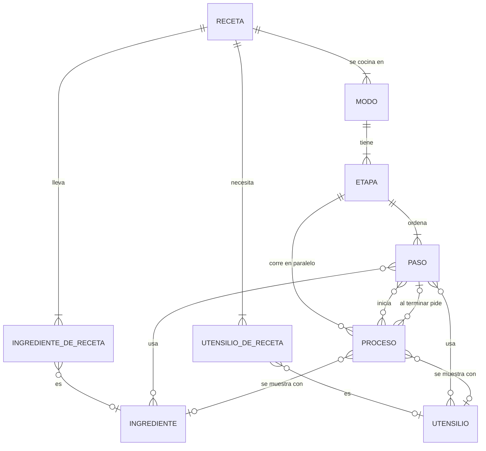

# Modelo de datos: Catálogo y POE

Las entidades del catálogo y sus relaciones. El formato campo por campo está en
[contracts/receta.md](contracts/receta.md); acá va qué es cada cosa, cómo se relaciona con
las demás y qué reglas cumple.

## Relaciones

## Receta

Un plato del catálogo, escrito como POE: dice qué hacer y cuándo, para que salga igual sin
importar quién lo haga.

| Atributo | Descripción |
|---|---|
| Identificador del plato | Único en el catálogo y estable |
| Nombre | Título completo del plato |
| Foto | Una, del plato terminado, compartida por todos sus modos |
| Momento | Almuerzo, cena… |
| Porciones | Para cuántas rinde |
| Sal agregada | En gramos |
| Nutrición | Por porción: calorías, proteína, fibra y sodio |
| Sobrantes | Qué se guarda y cómo, para repetir el plato |
| Criterios de diseño | Por qué la receta está armada así; título y texto de cada uno |
| Seguridad y conservación | Lista de reglas |

**Relaciones:** tiene uno o más modos de preparación; lleva uno o más ingredientes y
necesita uno o más utensilios.

**Reglas:**

- El plato, las porciones, la nutrición, la foto, los ingredientes y sus cantidades son los
  mismos en todos sus modos.
- En la lista de recetas aparece una vez, no una por modo.
- Existe como planilla para imprimir, como PDF y como datos, y las tres dicen lo mismo.
- En el catálogo propio, el tiempo declarado es el real de punta a punta: el reloj arranca
  al abrir el freezer e incluye descongelar, lavar y cortar.

## Modo de preparación (versión)

Una manera de cocinar la receta. Cambia el orden de los pasos y el tiempo total; no cambia
el plato.

| Atributo | Descripción |
|---|---|
| Número | 1, 2, 3… único dentro de la receta |
| Clave | Identificador del modo dentro de la receta |
| Título | Nombre corto («Flujo continuo», «Mise en place primero») |
| Resumen | Una o dos oraciones: qué cambia |
| Ícono | Un emoji |
| Tiempo total | La suma de las duraciones de sus etapas |
| Tiempo total en palabras | Como lo declara la planilla |
| Planilla y PDF | Los documentos imprimibles de este modo |

**Relaciones:** pertenece a una receta; tiene una o más etapas.

**Reglas:**

- Los modos de una receta se ordenan del más lento al más rápido.
- El más lento es el fácil y el que se propone; los demás son difíciles. La dificultad se
  deriva del tiempo, no se declara.
- Un modo nunca se reemplaza por otro distinto: uno nuevo lleva el número siguiente.

## Etapa

Un tramo del modo con su propio reloj.

| Atributo | Descripción |
|---|---|
| Identificador | `e1`, `e2`… prefijo de los de sus pasos y procesos |
| Número y nombre | Como en la planilla |
| Vigilancia | Si pasarse de tiempo altera el plato. Sin vigilancia, la app tranquiliza en vez de alarmar |
| Duración | Prevista |
| Arranque y cierre | Cuándo empieza y termina su reloj, en palabras |
| Pausa después | Las condiciones de la pausa que admite al terminar, o ninguna si no admite |

**Relaciones:** pertenece a un modo; ordena uno o más pasos y puede tener procesos
paralelos.

**Reglas:** la suma de las duraciones de las etapas es el tiempo total del modo.

## Paso

Trabajo de manos dentro de una etapa.

| Atributo | Descripción |
|---|---|
| Identificador | Estable; los tiempos reales de cada cocinada se guardan contra él |
| Inicio y duración | Previstos, contados desde el arranque de la etapa |
| Título | Qué se hace |
| Acciones | Una o más oraciones; son los sub-pasos |
| Crítico | Si pasarse de tiempo arruina algo |
| Espera | Si es una espera sin tarea |
| Porqué | Etiquetas (nutrición, desperdicio, tiempo, seguridad, sabor) y texto de referencia |

**Relaciones:** pertenece a una etapa; usa cero o más ingredientes y utensilios de la
receta; al terminar inicia cero o más procesos de su etapa.

**Reglas:**

- Los pasos de una etapa van en orden y no se solapan: las manos hacen una cosa por vez.
  Entre dos pasos puede quedar un hueco mientras corre un proceso.
- El último paso termina con la etapa.
- Solo puede usar ingredientes y utensilios que estén en la lista de la receta.

## Proceso paralelo

Algo que corre solo mientras las manos hacen otra cosa: un descongelado, una olla al fuego,
un reposo. Es un carril de la línea de tiempo.

| Atributo | Descripción |
|---|---|
| Identificador | Con el prefijo de su etapa |
| Nombre | Como se muestra |
| Tipo | Frío, calor, hervor, tapado o reposo; define color e ícono |
| Inicio y fin | Dentro de la etapa |
| Crítico | Si al vencer hay que actuar de inmediato o puede esperar |
| Nota | Qué no hacer, qué pasa si se demora |

**Relaciones:** pertenece a una etapa; lo inicia un paso; puede mostrarse con la foto de un
ingrediente o de un utensilio de la receta; al vencer puede pedir un paso de su etapa.

**Reglas:** queda entero dentro de su etapa; varios procesos pueden solaparse entre sí y
con los pasos.

## Ingrediente

Un producto concreto del catálogo: uno, con su marca y su foto.

| Atributo | Descripción |
|---|---|
| Identificador | Único en el catálogo y estable |
| Nombre | El del producto |
| Categoría | Frescos, congelados, secos y envasados, refrigerados y al vacío, o especias y condimentos |
| Características | Marca, variedad, presentación, formato, estado, tratamiento, temperatura de conservación, origen, fabricante, código de barras |
| Información del envase | Ingredientes declarados, alérgenos declarados, información nutricional |
| Fotos | Una principal y, si hay, tomas secundarias |

**Relaciones:** lo usan cero o más recetas. La relación con la receta («ingrediente de la
receta») lleva lo que es propio de ese uso: el nombre con que la receta lo llama, la
cantidad y la preparación en que entra al plato.

**Reglas:** un ingrediente de la receta puede no tener ficha (agua); entonces vale solo por
su nombre y no tiene foto.

## Utensilio

Un utensilio o equipo concreto del catálogo, con sus especificaciones reales. Las recetas
se diseñan respetando sus capacidades.

| Atributo | Descripción |
|---|---|
| Identificador | Único en el catálogo y estable |
| Nombre | El del producto |
| Especificaciones | Marca, tipo, capacidad, medidas, material, tapa, compatibilidad |
| Incluye | Piezas y accesorios |
| Fotos | Una principal y, si hay, tomas secundarias |
| Manual | Si el equipo lo tiene |

**Relaciones:** lo usan cero o más recetas. La relación con la receta («utensilio de la
receta») lleva el nombre con que la receta lo llama, que puede ser más específico que el de
la ficha, y para qué se usa.

**Reglas:** un juego de piezas con un solo envase es un solo utensilio; los recursos fijos
de la cocina también son utensilios; un utensilio de la receta puede no tener ficha (un
bol, un plato) y entonces vale solo por su nombre.

## Entidades que suman los requerimientos posteriores

No tienen definición cerrada; cada una depende de una pregunta abierta de
[spec.md](spec.md).

| Entidad | Requerimiento | Qué representa |
|---|---|---|
| Tarea | RF-05 | Lo que la receta declara por unidad de trabajo: si se cronometra, si es crítica, su mínimo y con qué corre en paralelo. Queda por definir si unifica paso y proceso |
| Variante | RF-08, RF-08a | Una combinación de sin sal, cero desperdicio y cantidad de porciones de una receta |
| Advertencia | RF-06d, RF-06e | Si la receta tiene TACC y los octógonos que le corresponden |
| Ingrediente o utensilio propio | RF-52 | Uno que agrega quien usa la app |
| Lo que hay en casa | RF-52 | Los ingredientes y utensilios que alguien tiene |
| Supermercado | RF-54, RF-56 | Un lugar de compra integrado, que agrega un administrador |
| Precio | RF-53 a RF-55 | El precio actual de un ingrediente o utensilio en un lugar |
